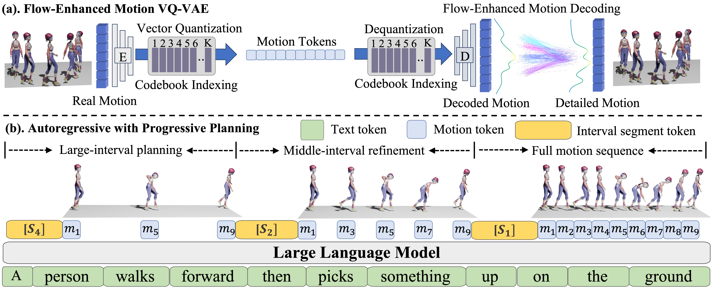
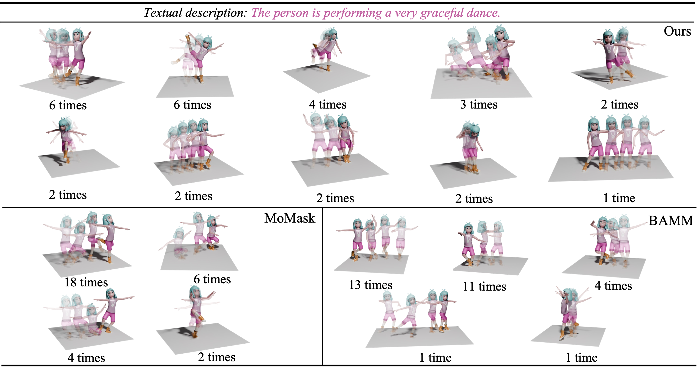

<h1 align='center' style="text-align:center; font-weight:bold; font-size:2.0em;letter-spacing:2.0px;"> PlanMoGPT: Flow-Enhanced Progressive Planning for Text to Motion Synthesis</h1>
<p align='center' style="text-align:center;font-size:1.25em;">
<sup>1</sup><a href="https://chuhaojin.github.io/">Chuhao Jin</a>, <sup>1</sup><a href="https://planmogpt.github.io/">Haosen Li</a>, <sup>1</sup><a href="https://planmogpt.github.io/">Bingzi Zhang</a>, <sup>2</sup><a href="https://scholar.google.com/citations?hl=zh-CN&user=s3jVzK8AAAAJ">Che Liu</a>, <sup>1</sup><a href="https://gsai.ruc.edu.cn/english/wangxt">Xiting Wang</a>, <sup>1</sup><a href="https://scholar.google.com/citations?hl=zh-CN&user=v5LctN8AAAAJ">Ruihua Song</a><sup>*</sup>, </span>
                                <span class="author-block"><sup>1</sup><a href="https://scholar.google.com/citations?hl=zh-CN&user=0yNkmO4AAAAJ">Wenbing Huang</a>, <sup>1</sup><a href="https://planmogpt.github.io/">Ying Qin</a>, <sup>2</sup><a href="https://scholar.google.com/citations?hl=zh-CN&user=8R0hla4AAAAJ">Fuzheng Zhang</a>, <sup>2</sup><a href="https://openreview.net/profile?id=~Di_ZHANG3">Di Zhang</a></span><br>
                                <sup>1</sup>GSAI, Renmin Universuty of China, <sup>2</sup>Kuaishou<br/>
                                <b><em>ArXiv.</em> <br></b>
</p>
<p align='center' style="text-align:center;font-size:2.5 em;">
<b>
    <a href="https://planmogpt.github.io/" target="_blank" style="text-decoration: none;">[Paper]</a>&nbsp;&nbsp;&nbsp;&nbsp;&nbsp;&nbsp;<a href="https://planmogpt.github.io/" target="_blank" style="text-decoration: none;">[Project Page]</a>&nbsp;&nbsp;&nbsp;&nbsp;&nbsp;&nbsp;<a href="https://planmogpt.github.io/" target="_blank" style="text-decoration: none;">[Demo]</a>
</b>
</p>


## Abstract
Recent advances in large language models (LLMs) have enabled breakthroughs in many multimodal generation tasks, but a significant performance gap still exists in text-to-motion generation, where LLM-based methods lag far behind non-LLM methods. We identify the granularity of motion tokenization as a critical bottleneck: fine-grained tokenization induces local dependency issues, where LLMs overemphasize short-term coherence at the expense of global semantic alignment, while coarse-grained tokenization sacrifices motion details. To resolve this issue, we propose PlanMoGPT, an LLM-based framework integrating progressive planning and flow-enhanced fine-grained motion tokenization. First, our progressive planning mechanism leverages LLMs' autoregressive capabilities to hierarchically generate motion tokens by starting from sparse global plans and iteratively refining them into full sequences. Second, our flow-enhanced tokenizer doubles the downsampling resolution and expands the codebook size by eight times, minimizing detail loss during discretization, while a flow-enhanced decoder recovers motion nuances. Extensive experiments on text-to-motion benchmarks demonstrate that it achieves state-of-the-art performance, improving FID scores by 63.8% (from 0.380 to 0.141) on long-sequence generation while enhancing motion diversity by 49.9% compared to existing methods. The proposed framework successfully resolves the diversity-quality trade-off that plagues current non-LLM approaches, establishing new standards for text-to-motion generation.

## Approach Overview
<p align="center">

</p>
<p align="left">
<font size=3 >PlanMoGPT consists of two components: (a). A flow-enhanced motion tokenizer converts motion into fine-grained tokens with minimal loss; (b). An LLM integrates with progressive planning, which progressively generates from a larger interval motion tokens to the full motion token sequence.</font>
</p>


## ***News***

- *06/22/2025* 🌟 We release the paper and project page of PlanMoGPT. 


## A Quick Glance of Diversity
<p align="center">

</p>
<p align="center">
<font size=3 >Different methods repeatedly generate 30 motions based on the same text. Similar motions are grouped and reported times.</font>
</p>

<br>


## Conclusion
In this paper, we address what limits the ability of LLM in text-to-motion generation tasks. We identify the granularity of motion tokenization as a critical bottleneck. That is, fine-grained tokens lead to severe local dependencies, while coarse-grained motion tokens lose motion details.To address this issue, we propose PlanMoGPT, an LLM-based framework integrating progressive planning and flow-enhanced fine-grained motion tokenization. Extensive experiments demonstrate that PlanMoGPT not only generates precise and diverse human motions but also outperforms the state-of-the-art method MoMask in both human and automated evaluations on short and long sequence datasets. What's more, PlanMoGPT resolves the diversity-quality dilemma in existing non-LLM approaches. which further verifies the necessity of exploiting the potential of LLM for text-to-motion tasks. In the future, we will explore more flexible planning, such as manually selected keyframes. In addition, we will also explore how to extend PlanMoGPT to generate motion with expressions and hand movements.


## Citation
If you find this useful in your research, please consider citing:

```
TBD
```

<br><br>